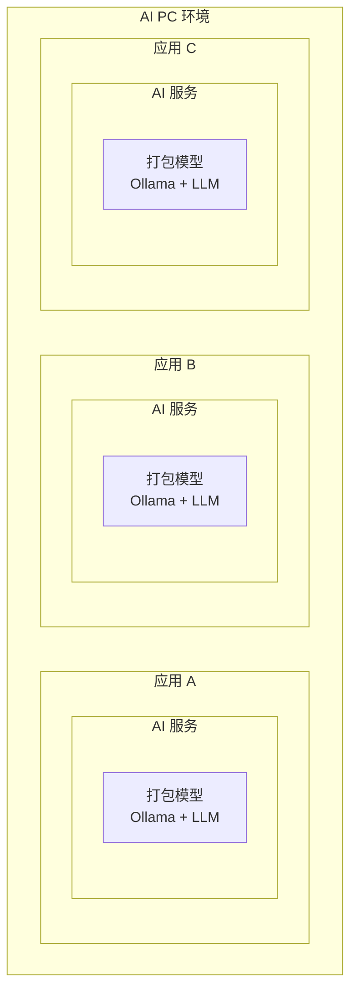
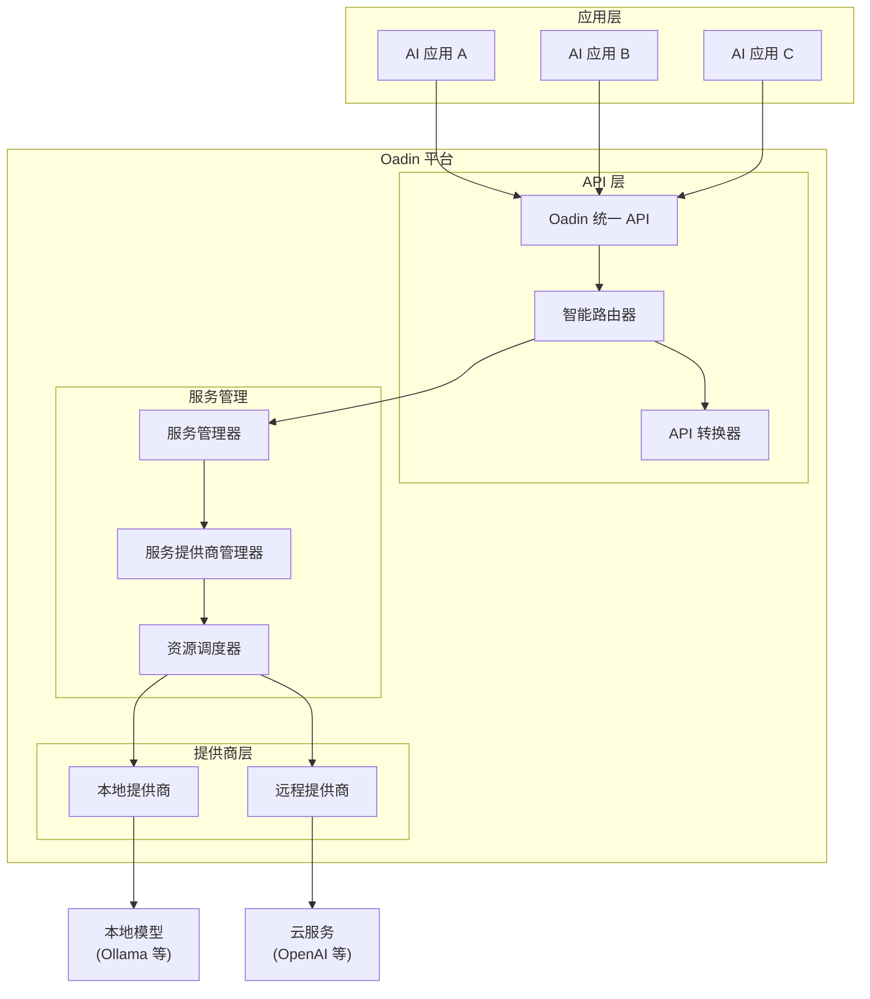
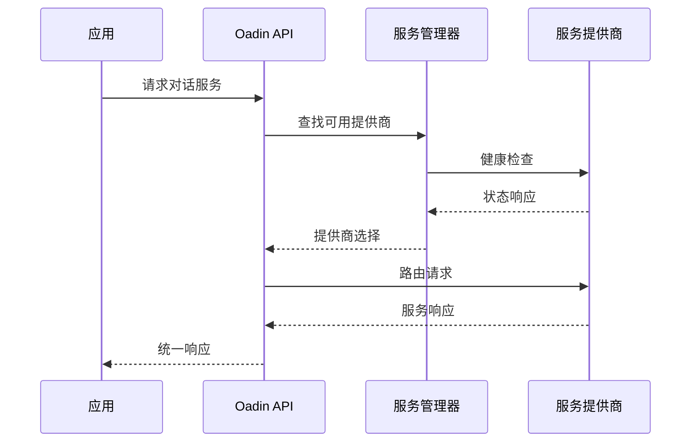
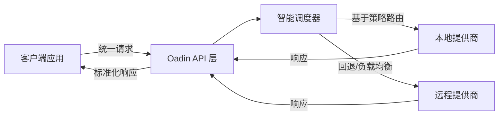
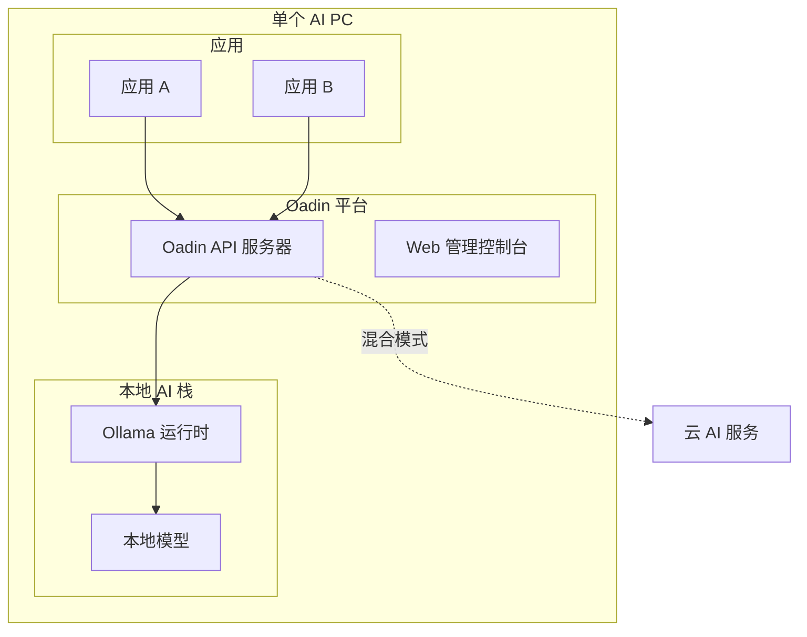
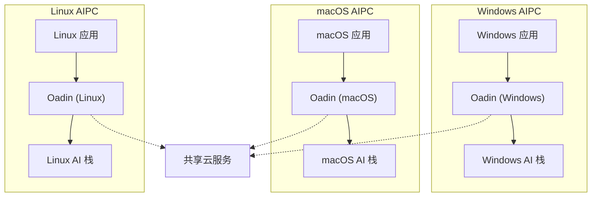

# 架构设计

本文档描述了 Oadin（开放 AIPC 开发基础设施）的架构设计和实现，这是一个为 AI PC 应用开发提供的统一 AI 服务平台。

## 📋 目录

- [概述](#概述)
- [问题陈述](#问题陈述)
- [解决方案架构](#解决方案架构)
- [核心组件](#核心组件)
- [服务模型](#服务模型)
- [API 层设计](#api-层设计)
- [部署架构](#部署架构)
- [实现细节](#实现细节)

## 🎯 概述

Oadin 是一个生产级 AI 服务基础设施，为 AI PC 应用开发提供统一平台。它通过引入面向服务的架构来解决 AI 应用部署的根本挑战，该架构将应用与 AI 服务提供商解耦，同时确保兼容性、可用性和最优资源利用。

## ❓ 问题陈述

### 单体 AI 应用打包问题

传统的 AI 应用遵循"包含一切"的方法，每个应用都打包自己的 AI 模型、推理框架和服务。这会带来几个关键问题：



**主要问题：**
- **资源碎片化**：多个应用竞争有限的 CPU、GPU 和 NPU 资源
- **存储开销**：应用间冗余的模型存储消耗大量磁盘空间
- **平台锁定**：打包的模型针对特定供应商/平台优化
- **部署复杂性**：大型应用包导致更长的下载和更新时间

### 解耦架构中的工程挑战

在转向面向服务的模型时，会出现新的挑战：

- **API 兼容性**：不同的 AI 服务提供商使用不同的 API 规范
- **服务可用性**：应用必须处理本地服务不可用的场景
- **动态扩展**：需要在本地和远程服务之间进行智能路由

## 💡 解决方案架构

Oadin 通过统一架构解决这些挑战，在应用和 AI 服务提供商之间引入中间 API 层。

### 高层架构



## 🔧 核心组件

### 1. 统一 API 层

Oadin API 层为常见的 AI 服务提供标准化接口：

- **对话服务**：支持流式输出的多轮对话
- **嵌入服务**：用于语义搜索的文本向量化
- **生成服务**：单轮文本生成
- **文本转图像服务**：从文本提示生成图像
- **模型上下文协议 (MCP)**：工具集成框架

### 2. 服务管理

**服务管理器**：管理 AI 服务的生命周期
- 服务注册和发现
- 健康监控和状态跟踪
- 配置管理

**服务提供商管理器**：处理多个服务提供商
- 本地提供商管理（Ollama、本地模型）
- 远程提供商集成（OpenAI、云服务）
- 身份验证和授权

### 3. 智能调度引擎

调度器实现混合策略以实现最优资源利用：

```go
type HybridPolicy string

const (
    HybridPolicyDefault      HybridPolicy = "default"
    HybridPolicyAlwaysLocal  HybridPolicy = "always_local"
    HybridPolicyAlwaysRemote HybridPolicy = "always_remote"
)
```

**调度逻辑**：
- **默认策略**：基于资源可用性自动选择本地或远程
- **总是本地**：强制请求仅使用本地提供商
- **总是远程**：将所有请求路由到远程服务

### 4. API 转换层

处理不同 API 规范之间的兼容性：
- OpenAI API 兼容层
- 自定义提供商 API 适配
- 请求/响应转换

## 🏗️ 服务模型

### 服务定义

**服务**表示可由多个提供商实现的逻辑 AI 能力（对话、嵌入等）：

```json
{
  "service_name": "chat",
  "hybrid_policy": "default",
  "service_providers": {
    "local": "local_ollama_chat",
    "remote": "openai_chat"
  }
}
```

### 服务提供商定义

**服务提供商**是服务的具体实现：

```json
{
  "provider_name": "local_ollama_chat",
  "service_name": "chat",
  "service_source": "local",
  "api_flavor": "ollama",
  "url": "http://localhost:11434/api/chat",
  "auth_type": "none"
}
```

### 服务发现和注册



## 🌐 API 层设计

### RESTful 接口

Oadin 标准化 REST API：

```
POST /v1/chat/completions
POST /v1/embeddings
POST /v1/completions
POST /v1/images/generations
```

### 内部管理 API

```
GET    /oadin/{version}/service
POST   /oadin/{version}/service
PUT    /oadin/{version}/service
GET    /oadin/{version}/service_provider
POST   /oadin/{version}/service_provider
DELETE /oadin/{version}/service_provider
```

### 请求流程



## 🚀 部署架构

### 独立部署



### 多平台部署



## ⚙️ 实现细节

### 技术栈

- **后端**：Go 1.24+ 支持 CGO
- **数据库**：SQLite 与向量扩展 (sqlite-vec)
- **HTTP 框架**：Gin web 框架
- **配置管理**：Viper 配置管理
- **构建系统**：跨平台 Makefile 支持

### 关键模块

```
internal/
├── api/           # REST API 处理器和路由
├── server/        # 核心业务逻辑
│   ├── service.go           # 服务管理
│   ├── service_provider.go  # 提供商管理
│   └── model.go             # 模型管理
├── provider/      # 提供商引擎实现
├── schedule/      # 智能调度逻辑
├── datastore/     # 数据持久化层
└── types/         # 核心数据结构
```

### 服务提供商引擎

```go
type ProviderEngine interface {
    HealthCheck() error
    ProcessRequest(ctx context.Context, request interface{}) (interface{}, error)
    GetSupportedModels() ([]string, error)
}
```

### 配置管理

服务和提供商通过 YAML 配置：

```yaml
services:
  chat:
    hybrid_policy: "default"
    local_provider: "local_ollama_chat"
    remote_provider: "openai_chat"

providers:
  local_ollama_chat:
    service_name: "chat"
    service_source: "local"
    api_flavor: "ollama"
    url: "http://localhost:11434/api/chat"
```

### 监控和可观测性

- 所有提供商的健康检查端点
- 资源利用率监控
- 请求/响应日志记录
- 性能指标收集

### 特性优势

#### 1. 解决资源冲突
通过共享服务模式，Oadin 避免了多个应用同时加载相同模型导致的资源竞争，显著提高了系统整体效率。

#### 2. 降低部署复杂度
应用开发者无需关心底层 AI 模型的部署和管理，只需通过统一 API 调用所需服务，大大降低了应用的体积和部署复杂度。

#### 3. 提供混合云支持
智能调度系统根据本地资源状况和服务质量要求，自动在本地和云端服务之间进行切换，确保最佳用户体验。

#### 4. 确保跨平台兼容
通过 API 转换层，Oadin 屏蔽了不同 AI 服务提供商之间的 API 差异，使应用能够无缝在不同平台间迁移。

---

这种架构使 Oadin 能够为 AI PC 应用开发提供统一、可扩展和高效的平台，同时在不同的 AI 服务提供商和部署环境中保持灵活性和兼容性。
