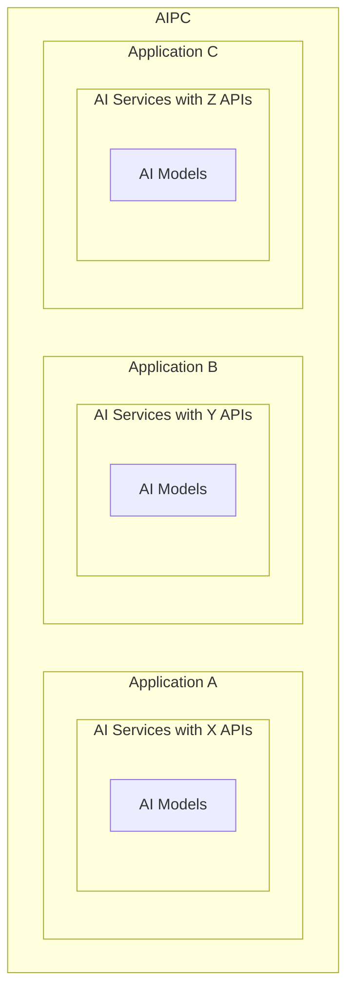
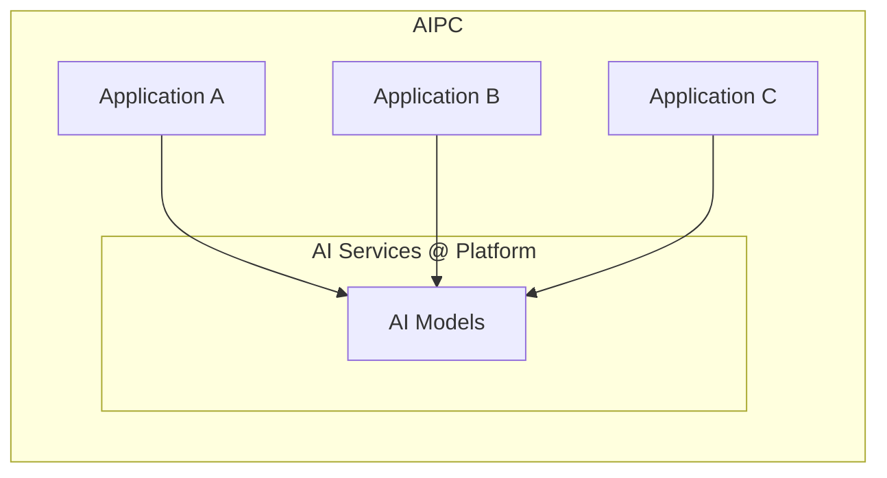
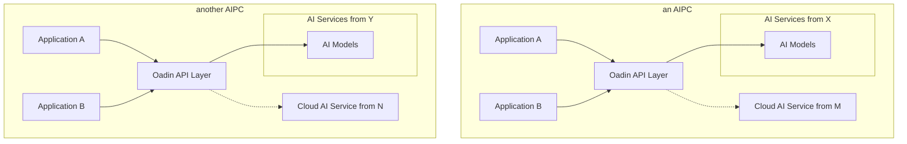

# Oadin针对的问题陈述

## 把什么都打包发布出去的方式很糟糕

如今，大多数应用在集成如“帮我写作”等 AI 相关功能时，需要从头开始进行整合。这通常导致将应用中的所有内容作为一个单体分发包进行发布。
例如，应用包可能需要包括LLM模型、Ollama 推理和部署框架，以及应用的其他部分。

这在上面的图中展示了在 AIPC 上形成的情况。在 PC 上，每个与 AI 相关的应用程序都包含自己的模型和相关 AI 框架，遵循我们所说的“应用包揽一切”模式。这种方法面临几个挑战：

- 应用程序捆绑的模型和 AI 框架通常仅针对特定平台（例如，特定供应商的 AIPC）进行调整或优化，而不会惠及其他平台。

- 每个 AI 应用都变得显著更大，导致下载和更新时间更长。多个应用还可以共同消耗 PC 上大量的磁盘空间。

- 由于 AIPC 计算资源（CPU、GPU、NPU）和内存有限，同时运行多个 AI 应用具有挑战性。每个应用都必须托管自己的模型，导致它们之间产生资源竞争。

## 解耦 AI 应用与通用 AI 服务

在实践中，大多数应用，除了一些高度专业化的 AI 驱动应用外，主要依赖于少数通用 AI 服务。例如，单个 AIPC 内的多个应用可能都存在对文本编辑功能的共同需求。
通过提供集中优化的“帮我写作” AI 服务，平台可以显著提高效率并减少冗余。这种共享服务使应用能够专注于其核心功能，避免开发和维护自身文本编辑能力的开销。

这种新模式将AI 应用与通用 AI 服务区分开来。应用可以专注于其核心功能，在需要时调用平台提供的 AI 服务。这种方法解决了“什么都提供”模式中的局限性。

## Oadin AI 应用统一架构和 API

尽管将 AI 应用从通用 AI 服务中解耦的兴起趋势为单体人工智能部署的局限性提供了解决方案，但它也带来了一组新的工程挑战：

- **兼容性** - AI 应用需要调用自身未提供的 AI 服务，这些服务可能具有不同的 API，需要兼容性调整以确保在不同平台上的无缝部署。

- **可用性** - 应用程序需要设计成可在任何 PC 上部署，即使在缺乏本地安装 AI 服务的环境中。在本地服务不可用或需求量高的实例中，应用程序应无缝过渡到利用远程 AI 服务，例如由云或边缘计算平台提供的服务。

``Oadin`` (**AIPC Open Gateway**) 提出了一种统一的架构和 API 层来解决这两个问题。

- ``Oadin`` 定义了适用于大多数通用 AI 服务的统一 Oadin API 规范。

- 架构层面，应用程序现在将它们的 AI 请求发送到 ``Oadin API Layer`` 。 ``Oadin API Layer`` 将请求调度到合适的 AI 服务。

.. _compatibility_issue:

## 解决兼容性问题

理想情况下，应用程序应仅通过 ``Oadin API`` 与 AI 服务交互。这将确保兼容性，并使应用程序能够在任何平台上运行，无论其底层 AI 服务提供商是谁。然而，在现实中，某些应用程序或服务提供商可能不完全遵守 ``Oadin API`` 。

为了减轻这一问题， ``Oadin API Layer`` 将尝试通过执行必要的转换来弥合这些兼容性差距。这是可行的，因为许多 API，即使不完全相同，通常也与 OpenAI 的 API 具有相似之处。
通过利用这些相似性， ``Oadin API Layer`` 可以促进应用程序与各种 AI 服务之间的交互，即使它们的 API 并不完全兼容。

.. _availability_issue:

## 解决可用性问题

``Oadin API Layer`` 充当动态中介，智能地将应用程序的请求路由到最合适的 AI 服务提供商。通过监控系统资源如 CPU、GPU 和 NPU 的利用率，它可以确定何时本地服务过载。
在这种情况下，该层可以无缝地将请求重定向到基于云的 AI 服务提供商，优化性能并确保服务不间断。
这种灵活性得益于 ``Oadin API Layer`` 通过转换和匹配处理潜在 API 不兼容性的能力，即使基于云的 AI 服务的 API 与应用程序使用的略有不同。

