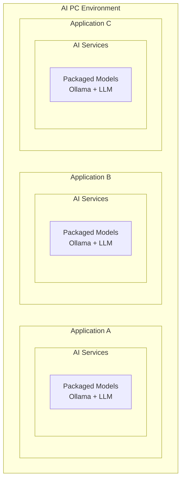

# Architecture Design

This document describes the architecture design and implementation of Oadin (Open AIPC Development Infrastructure), a unified AI service platform for AI PC application development.

## 📋 Table of Contents

- [Overview](#overview)
- [Problem Statement](#problem-statement)
- [Solution Architecture](#solution-architecture)
- [Core Components](#core-components)
- [Service Model](#service-model)
- [API Layer Design](#api-layer-design)
- [Deployment Architecture](#deployment-architecture)
- [Implementation Details](#implementation-details)

## 🎯 Overview

Oadin is a production-grade AI service infrastructure that provides a unified platform for AI PC application development. It addresses the fundamental challenges of AI application deployment by introducing a service-oriented architecture that decouples applications from AI service providers while ensuring compatibility, availability, and optimal resource utilization.

## ❓ Problem Statement

### Monolithic AI Application Packaging Issue

Traditional AI applications follow an "include everything" approach where each application packages its own AI models, inference frameworks, and services. This creates several key problems:

**Major Issues:**
- **Resource Fragmentation**: Multiple applications competing for limited CPU, GPU, and NPU resources
- **Storage Overhead**: Redundant model storage across applications consuming significant disk space
- **Platform Lock-in**: Packaged models optimized for specific vendors/platforms
